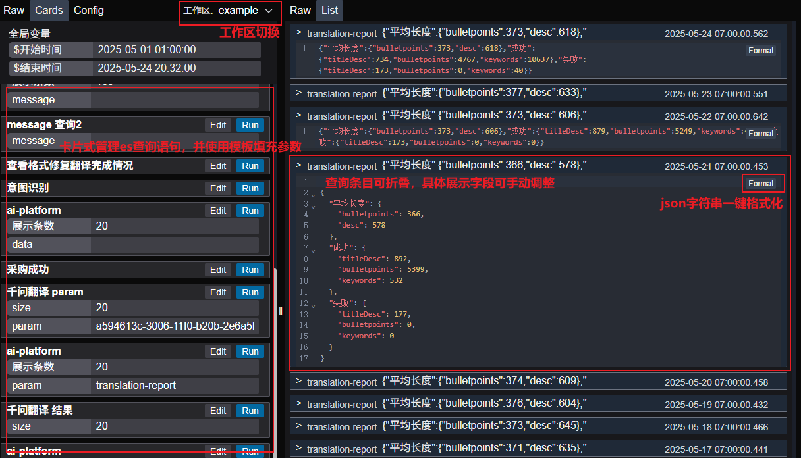
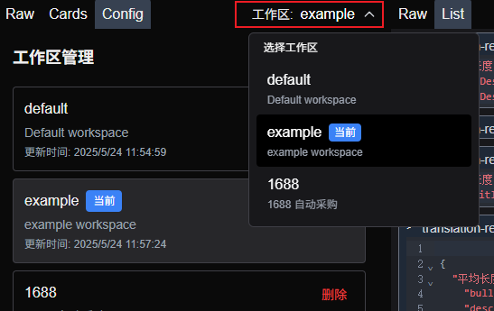

# ElasticSearch 查询查看器 (ES Viewer)

一个基于 Next.js 的现代化 ElasticSearch 查询和日志查看工具，提供直观的界面来执行 ES 查询并查看结果。

## 📸 项目预览

### 主界面


### 工作区选择


## ✨ 功能特性

- 🔍 **实时 ES 查询**: 支持原生 ElasticSearch 查询语法
- 📝 **代码编辑器**: 集成 CodeMirror，支持 JSON 语法高亮和自动完成
- 🎯 **快捷键支持**: `Ctrl+Enter` 快速执行查询
- 📊 **多视图显示**: 支持原始数据和结构化列表两种查看模式
- 🏢 **工作区管理**: 多工作区支持，便于管理不同的查询环境
- 🎨 **现代化 UI**: 基于 Tailwind CSS，支持暗色主题
- ⚡ **性能优化**: 使用 Service Worker 提升响应速度

## 🚀 快速开始

### 环境要求

- Node.js >= 18
- npm / yarn / pnpm

### 安装依赖

```bash
# 1. 安装npm包
yarn install

# 2. 配置文件
cp .env.example .env.local

# 3. 在 .env.local 对应字段写入你的es地址，用户名和密码
```

### 启动开发服务器

```bash
yarn dev
```

访问 [http://localhost:3999](http://localhost:3999) 查看应用。

使用 raw 查看模式，查看

### 生产环境构建

```bash
yarn build
yarn start
```

## 📁 项目结构

```
next-es/
├── app/                         # Next.js App Router
│   ├── (main)/                  # 主页面路由组
│   ├── components/              # 组件目录
│   │   ├── EsLogPanel/          # ES 查询主面板
│   │   ├── SearchResults/       # 搜索结果组件
│   │   ├── ParamCards/          # 参数卡片组件
│   │   ├── workspace/           # 工作区相关组件
│   │   └── ui/                  # 通用 UI 组件
│   ├── api/                     # API 路由，nextjs后端代码
│   └── utils/                   # 工具函数
├── data/                        # 数据文件
│   ├── workspaces.json          # 工作区配置
│   └── workspaces/              # 工作区数据目录
├── docs/                        # 文档和截图
├── public/                      # 静态资源
└── README.md                    # 项目说明
```

## 🎯 核心功能

### 1. ElasticSearch 查询
- 在左侧编辑器中输入 ES 查询语句
- 支持标准的 ElasticSearch Query DSL
- 使用 `Ctrl+Enter` 快速执行查询

### 2. 结果查看
- **Raw 模式**: 查看原始 JSON 响应
- **List 模式**: 结构化列表显示，便于浏览大量数据

### 3. 工作区管理
- 创建和切换不同的工作区
- 每个工作区独立管理查询模板和配置
- 支持工作区描述和时间戳记录

### 4. 查询模板
- 保存常用查询为模板
- 快速加载预设查询
- 支持参数化查询

## 🛠 技术栈

- **框架**: Next.js 14 (App Router)
- **语言**: TypeScript
- **样式**: Tailwind CSS
- **编辑器**: CodeMirror 6
- **状态管理**: Zustand
- **ES 客户端**: @elastic/elasticsearch
- **主题**: Dracula (暗色主题)

## 📋 开发路线图

- [x] 增加工作区，共享工作区
- [x] 模板编辑窗口优化
- [x] 查询历史记录
- [x] 导出功能 (JSON/CSV)
- [ ] 支持定制不同的查询结果列表

## 🤝 贡献指南

1. Fork 本仓库
2. 创建你的特性分支 (`git checkout -b feature/AmazingFeature`)
3. 提交你的修改 (`git commit -m 'Add some AmazingFeature'`)
4. 推送到分支 (`git push origin feature/AmazingFeature`)
5. 打开一个 Pull Request

## 📝 许可证

本项目采用 MIT 许可证。详见 [LICENSE](LICENSE) 文件。

## 🙋‍♂️ 支持

如果你在使用过程中遇到任何问题，欢迎：

- 提交 [Issue](../../issues)
- 参与 [Discussions](../../discussions)
- 查看项目 [Wiki](../../wiki)

---

Built with ❤️ using Next.js and ElasticSearch
