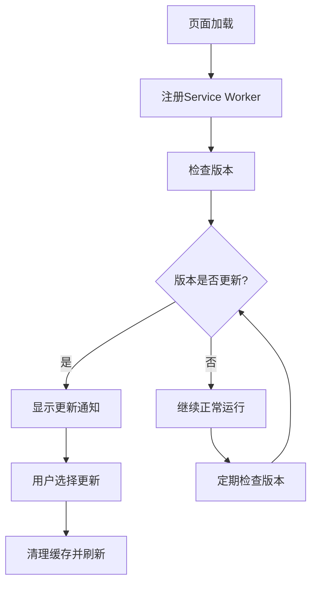

# Service Worker 自检机制使用指南

## 概述

本系统实现了一个智能的Service Worker自检机制，能够在版本更新时自动检测并主动更新，解决传统Service Worker缓存旧页面的问题。

## 主要功能

### 1. 版本检测机制
- **自动检测**: 每5分钟自动检查一次版本更新
- **实时通知**: 发现新版本时立即通知用户
- **智能缓存**: 区分静态资源和动态内容的缓存策略

### 2. 资源加载失败恢复
- **重试机制**: 网络请求失败时自动重试（最多3次）
- **降级策略**: 失败时提供缓存内容或离线页面
- **错误通知**: 关键资源失败时主动通知用户

### 3. 用户友好的更新体验
- **非侵入式通知**: 右上角优雅的更新提醒
- **用户选择**: 提供"立即更新"和"稍后提醒"选项
- **进度反馈**: 更新过程中的状态提示

## 文件结构

```
app/
├── utils/serviceWorker/
│   ├── sw.tsx                 # Service Worker Hook
│   └── swRegistration.ts      # 注册和管理逻辑
├── components/
│   └── UpdateNotification.tsx # 更新通知组件
└── api/version/
    └── route.ts              # 版本检查API

public/
├── serviceWorker.js          # Service Worker主文件
└── offline.html             # 离线页面

scripts/
└── update-version.js        # 版本更新脚本
```

## 使用方法

### 1. 基本集成

在你的主应用组件中引入Service Worker：

```tsx
import { useSW } from '@/app/utils/serviceWorker/sw';
import UpdateNotification from '@/app/components/UpdateNotification';

export default function App() {
  return (
    <div>
      {/* 你的应用内容 */}
      <UpdateNotification />
    </div>
  );
}
```

### 2. 版本更新流程

#### 开发环境
```bash
# 更新版本号（自动更新所有相关文件）
node scripts/update-version.js 2.1.0

# 构建应用
npm run build

# 部署应用
npm run deploy
```

#### 手动更新版本号
如果不使用脚本，需要手动更新以下文件：
1. `package.json` - version字段
2. `public/serviceWorker.js` - CACHE_VERSION常量
3. `app/api/version/route.ts` - APP_VERSION常量

### 3. 版本检测API

版本检查API (`/api/version`) 返回格式：

```json
{
  "version": "2.1.0",
  "appVersion": "v2.1.0",
  "buildTime": "2024-01-15T10:30:00.000Z",
  "timestamp": 1705320600000,
  "node": "v18.17.0",
  "platform": "linux",
  "environment": "production",
  "buildId": "MjEwLTIwMjQ="
}
```

## Service Worker 功能详解

### 1. 智能缓存策略

#### API请求（网络优先）
```javascript
// API请求使用网络优先策略
if (url.pathname.startsWith('/api/')) {
  // 1. 尝试网络请求
  // 2. 失败时使用缓存
  // 3. 记录错误并通知主线程
}
```

#### 静态资源（缓存优先）
```javascript
// 静态资源使用缓存优先策略
// 1. 检查缓存
// 2. 缓存未命中时请求网络
// 3. 成功后更新缓存
```

### 2. 版本检测流程



### 3. 错误恢复机制

#### 网络错误处理
- 自动重试失败的请求
- 提供离线页面作为降级方案
- 网络恢复时自动重新检查更新

#### 资源加载失败
- 检测关键资源（JS/CSS）加载失败
- 提供"刷新页面"和"清除缓存"选项
- 自动记录错误日志

## 高级配置

### 1. 自定义检查间隔

```typescript
// 在 swRegistration.ts 中修改
const VERSION_CHECK_INTERVAL = 10 * 60 * 1000; // 10分钟
```

### 2. 自定义重试策略

```typescript
// 在 serviceWorker.js 中修改
const MAX_RETRY_COUNT = 5; // 最大重试次数
const RETRY_DELAY = 2000;  // 重试延迟(毫秒)
```

### 3. 自定义缓存策略

```javascript
// 添加特定路径的缓存规则
if (url.pathname.startsWith('/special-api/')) {
  // 自定义处理逻辑
}
```

## 调试和监控

### 1. 浏览器控制台命令

```javascript
// 手动检查版本
checkAppVersion()

// 清理所有缓存和Service Worker
clearAllServiceWorkers()

// 向Service Worker发送消息
sendMessageToSW('CHECK_VERSION')
```

### 2. 开发者工具

1. **Application > Service Workers**: 查看Service Worker状态
2. **Application > Storage**: 检查缓存内容
3. **Network**: 监控网络请求和缓存命中情况
4. **Console**: 查看版本检测日志

### 3. 常见问题排查

#### Service Worker 未注册
- 检查HTTPS环境（localhost除外）
- 确认 `serviceWorker.js` 文件可访问
- 查看控制台错误信息

#### 版本检测失败
- 检查 `/api/version` 端点是否正常
- 确认网络连接
- 查看Service Worker网络请求日志

#### 缓存未清理
- 手动执行 `clearAllServiceWorkers()`
- 检查Service Worker是否正确更新
- 尝试硬刷新（Ctrl+Shift+R）

## 性能优化建议

### 1. 缓存策略优化
- 静态资源使用长期缓存
- API响应使用短期缓存
- 关键资源优先加载

### 2. 网络请求优化
- 减少版本检查频率
- 使用压缩的API响应
- 实施请求去重

### 3. 用户体验优化
- 非阻塞式更新通知
- 渐进式Web应用特性
- 离线功能支持

## 部署注意事项

1. **版本号管理**: 使用语义化版本控制
2. **缓存清理**: 确保旧版本缓存被正确清理
3. **错误监控**: 设置错误报告和监控
4. **回滚策略**: 准备应用回滚方案
5. **用户通知**: 重大更新时提前通知用户

## 更新日志

### v2.0.0
- 新增智能版本检测机制
- 实现资源加载失败自动恢复
- 添加用户友好的更新通知
- 优化Service Worker缓存策略

### 后续计划
- [ ] 支持增量更新
- [ ] 添加更新内容预览
- [ ] 实现自动更新配置
- [ ] 增强离线功能 